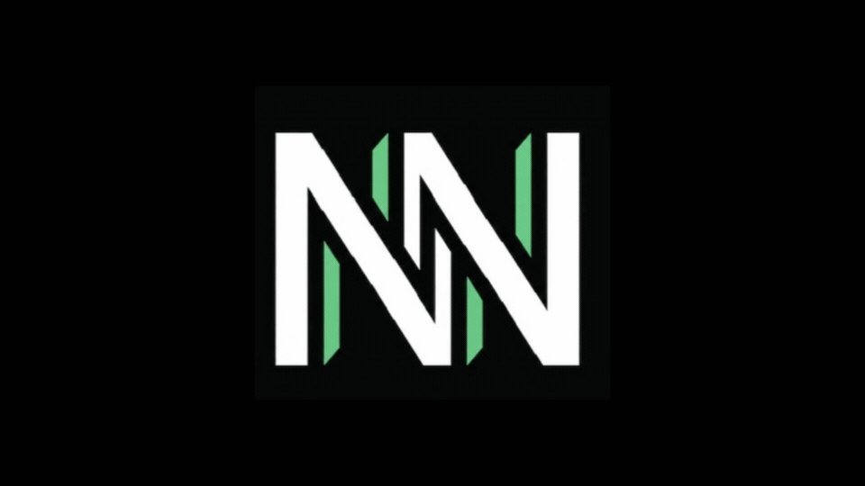

<!-- prettier-ignore -->
<div align="center">



# NexoNotes

*Sistema de Gestión de Documentación Técnica, Motor RAG Local y Servidor MCP*

[](README_en.md)
[](LICENSE.md)
[](https://www.docker.com/)
[](https://fastapi.tiangolo.com/)
[](https://github.com/pgvector/pgvector)
[](https://modelcontextprotocol.io/)
[](https://react.dev/)
[](https://www.typescriptlang.org/)
[](https://ai.google.dev/)
[](https://www.buymeacoffee.com/carlosNahuelSanchez)

[Descripción General](#descripción-general) • [Arquitectura](#arquitectura) • [Puertos](#puertos) • [Inicio Rápido](#inicio-rápido) • [Comandos CLI](#comandos-cli) • [Integración MCP](#integración-mcp) • [Guía de Usuario](#guía-de-usuario) • [Webhooks](#5-automatización-con-webhooks) • [API](#referencia-api) • [Apoyar](#apoyar-el-proyecto)

</div>

---

## Descripción General

**NexoNotes** es un sistema privado y autónomo de gestión de documentación técnica con motor **RAG (Retrieval-Augmented Generation)** y servidor nativo **MCP (Model Context Protocol)**, contenerizado mediante Docker.

Almacena todas las notas localmente en PostgreSQL y genera embeddings vectoriales de 768 dimensiones con `pgvector`. Permite organizar tu base de conocimiento técnica, consultarla mediante un asistente inteligente y compartir herramientas con agentes externos.

---

## Arquitectura

```
[ Navegador Web ]                      [ Agentes IA Externos ]
       │                         (Antigravity / Cursor / Claude / etc.)
       ▼ (Puerto 3780)                         │
[ Frontend: React + Nginx ]                    ▼ (Puerto 8781)
       │                                [ Servidor MCP ]
       ▼ (Proxy interno /api/)                 │
[ Backend: FastAPI ] ──────────────────────────┤
       │                                       │
       ▼                                       ▼
[ PostgreSQL 16 + pgvector ] ────────► [ Gemini API ]
  - notes (metadatos + contenido)        (Embeddings & RAG)
  - embeddings (Vector 768d + HNSW)
```

- **PostgreSQL 16 + pgvector:** Almacén relacional y vectorial con índice HNSW para búsqueda semántica.
- **Backend API (FastAPI):** Ingesta MarkItDown, generación RAG, exportaciones y webhooks.
- **Servidor MCP (Puerto 8781):** Expone herramientas para agentes de IA compatibles con HTTP y SSE.
- **Frontend SPA (React 18 + TS):** Gestor de notas, consola RAG y panel de métricas.

---

## Puertos

| Servicio | Endpoint | Descripción |
| :--- | :--- | :--- |
| **Frontend** | `http://localhost:3780` | Interfaz web de usuario |
| **Backend API** | `http://localhost:8780` | API REST y streaming RAG |
| **Documentación API** | `http://localhost:8780/docs` | Swagger / OpenAPI interactivo |
| **Servidor MCP** | `http://localhost:8781/sse` | Endpoint de conexión para agentes MCP |
| **PostgreSQL** | `localhost:5432` | Base de datos relacional y vectorial |

---

## Requisitos Previos

- **Docker Engine** 24.0+ y **Docker Compose** v2.0+
- **Python 3.10+** (para los comandos del CLI)
- **Clave de API de Google Gemini** (`GEMINI_API_KEY`)

---

## Inicio Rápido

### 1. Clonar el repositorio y configurar variables

```bash
git clone https://github.com/carlosNahuelSanchez/NexoNotes.git
cd NexoNotes
cp .env.example .env
```

Edita `.env` e ingresa tu `GEMINI_API_KEY`:

```env
GEMINI_API_KEY=tu_clave_de_gemini
POSTGRES_DB=nexonotes_db
POSTGRES_USER=nexonotes_admin
POSTGRES_PASSWORD=nexonotes_secure_pass
POSTGRES_PORT=5432
BACKEND_PORT=8780
FRONTEND_PORT=3780
LLM_MODEL=gemini-3.5-flash-lite
WEBHOOK_URL=
```

### 2. Instalar el CLI e iniciar

```bash
# Registrar nexonotes globalmente en el sistema
nexonotes install

# Iniciar todos los servicios
nexonotes start
```

Accede a la interfaz web en **`http://localhost:3780`**.

---

## Comandos CLI

| Comando | Descripción |
| :--- | :--- |
| `nexonotes install` | Registra el ejecutable `nexonotes` en el PATH del sistema |
| `nexonotes start` | Compila e inicia los contenedores en segundo plano |
| `nexonotes stop` | Detiene los contenedores conservando la base de datos |
| `nexonotes status` | Muestra el estado actual de los contenedores |
| `nexonotes logs` | Transmite los registros de todos los servicios en tiempo real |
| `nexonotes mcp-auto` | Asistente para inyectar la configuración MCP en tus agentes |
| `nexonotes mcp-list` | Lista el estado de vinculación MCP en los agentes detectados |

---

## Integración MCP

El servidor en el puerto `8781` expone tu base de notas para que herramientas de desarrollo y agentes de IA puedan consultarla y actualizarla.

### Herramientas disponibles

| Herramienta | Argumentos | Descripción |
| :--- | :--- | :--- |
| `search_notes` | `query, top_k=4` | Búsqueda semántica vectorial por similitud coseno |
| `get_note` | `note_id` | Obtiene el contenido completo y metadatos de una nota |
| `list_notes` | `folder?, tag?` | Lista notas filtrando por carpeta o etiqueta |
| `create_note` | `title, content, folder?, tags?` | Crea una nota e indexa automáticamente su vector |
| `list_folders` | *ninguno* | Lista todas las carpetas existentes |
| `ask_nexo` | `question, top_k=4` | Consulta al motor RAG y retorna respuesta con citas |

### Conexión automática

Ejecuta el asistente interactivo:

```bash
nexonotes mcp-auto
```

Permite configurar en un paso:
1. **Antigravity** (`~/.gemini/config/mcp_config.json`)
2. **Cursor** (`.cursor/mcp.json`)
3. **Claude Desktop** (`claude_desktop_config.json`)
4. **Windsurf** (`~/.codeium/windsurf/mcp_config.json`)
5. **Claude Code** (`~/.claude.json`)
6. **OpenCode** (`~/.config/opencode/opencode.json`)

### Configuración manual

Para conectar cualquier cliente compatible con MCP de forma manual:

```json
{
  "mcpServers": {
    "nexonotes": {
      "serverUrl": "http://localhost:8781/sse"
    }
  }
}
```

---

## Guía de Usuario

### 1. Gestión de Notas y Carpetas
- **Creación:** Usa los botones `+ NOTA` o `+ CARPETA` (o atajos `Alt+N` / `Alt+F`).
- **Organización:** Soporte para arrastrar y soltar (drag & drop) notas y carpetas en el árbol.
- **Búsqueda:** Filtra en tiempo real por texto o por etiquetas (`#tag`); las carpetas con coincidencias se expanden automáticamente.
- **Edición:** Editor Markdown con vista previa dividida y resaltado de sintaxis.

### 2. Importación y Exportación
- **Importar:** Arrastra archivos al navegador o usa el botón de importar. Compatible con `.md`, `.txt`, `.pdf`, `.docx` y `.zip` (conversión automática con MarkItDown).
- **Exportar:** Descarga notas individuales en `.md`, carpetas en `.zip`, o el workspace completo en **JSON** o **CSV/Excel**.

### 3. Asistente RAG (Consola Nexo)
- Accede a la pestaña `[2] NEXO`.
- Realiza consultas sobre tu base de conocimiento y recibe respuestas generadas por Gemini fundamentadas con enlaces a las notas fuente.

### 4. Estadísticas del Sistema
- Accede mediante el icono de gráfico en la cabecera (o `F3`).
- Muestra el total de notas, carpetas, etiquetas, porcentaje de vectorización, latencia de base de datos y actividad reciente.

### 5. Automatización con Webhooks
NexoNotes incluye un despachador de **webhooks asíncronos y no bloqueantes** para enlazar eventos del sistema con plataformas externas de automatización (como **n8n**, **Make**, **Zapier**, bots de Discord/Slack o microservicios propios):
- **Configuración:** Asigna la URL de tu endpoint en la variable `WEBHOOK_URL` del archivo `.env` (ej. `WEBHOOK_URL=https://tu-servidor.com/webhook`).
- **Eventos emitidos (HTTP POST en formato JSON):**
  - `note.created`: Notificación enviada al crear e indexar una nota (`{ "id": int, "title": str }`).
  - `note.updated`: Notificación enviada al modificar el contenido o título de una nota (`{ "id": int, "title": str }`).
  - `note.deleted`: Notificación enviada al eliminar una nota (`{ "id": int, "title": str }`).
  - `folder.deleted`: Notificación enviada al eliminar una carpeta y sus notas asociadas (`{ "folder": str, "notes_deleted": int }`).
- **Ejecución no bloqueante:** El backend emite cada evento en segundo plano con timestamp UTC ISO 8601, garantizando que tus operaciones y la UI no experimenten latencia.

---

## Referencia API

### Endpoints Principales (Puerto 8780)

| Método | Endpoint | Descripción |
| :--- | :--- | :--- |
| `GET` | `/health` / `/api/stats` | Métricas del sistema, cobertura vectorial y actividad |
| `GET` | `/api/notes` | Listado de notas (con filtros de búsqueda, tag y carpeta) |
| `POST` | `/api/notes` | Crea una nota y genera su embedding en `pgvector` |
| `PUT` | `/api/notes/{id}` | Modifica una nota y regenera su embedding |
| `DELETE` | `/api/notes/{id}` | Elimina una nota y su vector |
| `POST` | `/api/notes/import` | Ingesta y conversión de documentos a Markdown |
| `GET` | `/api/notes/{id}/export` | Descarga de nota en `.md` |
| `GET` | `/api/notes/export/all` | Exportación total en JSON o CSV (`?format=json\|csv`) |
| `GET` | `/api/notes/folders` | Lista de carpetas |
| `GET` | `/api/notes/tags` | Lista de etiquetas |
| `GET` | `/api/nexo/stream` | Streaming de respuestas RAG vía SSE |

### Endpoints MCP (Puerto 8781)

| Método | Endpoint | Descripción |
| :--- | :--- | :--- |
| `POST` | `/sse`, `/mcp`, `/` | Inicialización y ejecución de herramientas JSON-RPC |
| `GET` | `/sse` | Canal de Server-Sent Events |
| `POST` | `/messages/` | Recepción de mensajes en sesiones SSE |

---

## Estructura del Proyecto

```
NexoNotes/
├── docker-compose.yml    # Orquestación de servicios (db, backend, frontend, mcp)
├── .env.example          # Plantilla de variables de entorno
├── nexonotes             # Script de entrada para Linux / macOS
├── nexonotes.bat         # Script de entrada para Windows CMD
├── README.md             # Documentación en Español
├── README_en.md          # Documentación en Inglés
├── LICENSE.md            # Licencia Apache 2.0
├── NOTICE                # Avisos y atribuciones de la licencia
├── backend/              # API FastAPI, pgvector y motor RAG
│   ├── app/
│   │   ├── main.py       # Rutas principales y telemetría
│   │   ├── mcp_server.py # Servidor MCP independiente
│   │   ├── database.py   # Conexión SQLAlchemy y pgvector
│   │   ├── models.py     # Modelos relacionales y vectoriales
│   │   ├── routers/      # Endpoints modulares de notas y RAG
│   │   └── services/     # RAG, MarkItDown y Webhooks
│   └── Dockerfile
├── frontend/             # SPA React 18 + TypeScript
│   ├── src/
│   │   ├── App.tsx       # Componente raíz con persistencia de pestañas
│   │   ├── components/   # Árbol de carpetas, editor, consola Nexo, etc.
│   │   └── index.css     # Estilos globales
│   └── Dockerfile
└── scripts/              # Scripts auxiliares de CLI y configuración MCP
    ├── nexonotes.py      # Motor central del CLI global
    ├── setup-mcp.bat     # Acceso directo para Windows
    └── setup-mcp.sh      # Acceso directo para Unix
```

---

## Apoyar el Proyecto

Si NexoNotes te resulta útil y deseas apoyar su desarrollo y mantenimiento continuo, ¡puedes invitarme un café!

<div align="center">

<a href="https://www.buymeacoffee.com/carlosNahuelSanchez" target="_blank"></a>

</div>

---

## Licencia

Este proyecto se distribuye bajo la licencia **[Apache License 2.0](LICENSE.md)**. El texto completo de la licencia se encuentra incluido en `LICENSE.md`, y se adjunta una nota de atribución en `NOTICE` para cumplimiento de la licencia y reconocimiento de los autores.

Se permite el uso, modificación, distribución y uso comercial, siempre respetando los términos de la licencia Apache 2.0 y manteniendo los avisos de copyright y atribución correspondientes.

---

<div align="center">

Hecho por el equipo de **[Nexus Studio](https://nexus-studio-dev.netlify.app/)**

</div>
